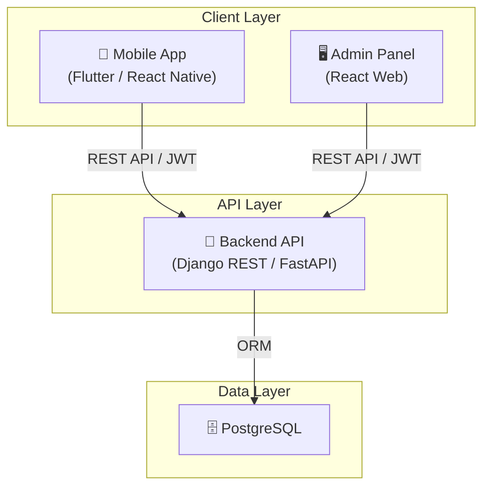
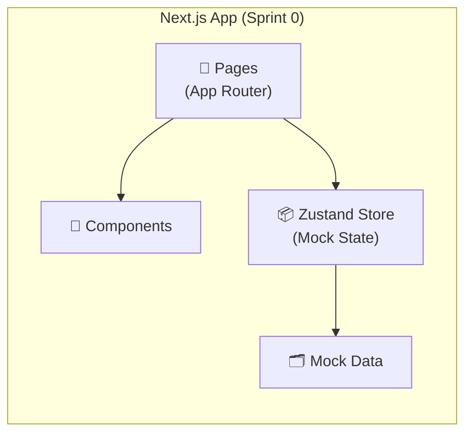
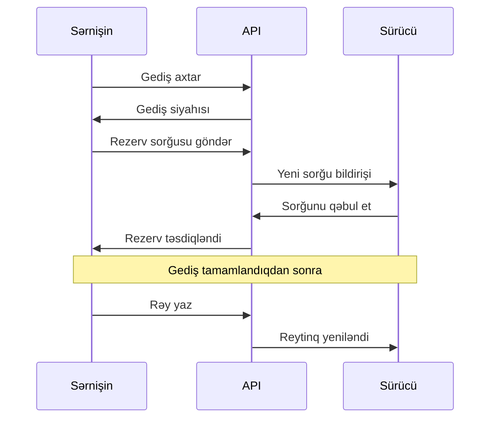

# Architecture — Yolüstü

## High-Level Architecture



## Sprint 0 Prototipi Arxitekturası

Sprint 0-da real backend yoxdur. Prototipi aşağıdakı arxitektura ilə qurulub:



## Komponent Arxitekturası

```
src/
├── app/              # Next.js App Router pages
│   ├── auth/         # Authentication pages
│   ├── profile/      # Profile pages
│   ├── search/       # Search page
│   ├── trips/        # Trip listing & details
│   ├── bookings/     # Booking management
│   ├── driver/       # Driver dashboard
│   ├── reviews/      # Review creation
│   └── admin/        # Admin panel
├── components/
│   ├── layout/       # MobileShell, BottomNav, TopBar
│   ├── ui/           # Button, Card, Input, Badge, etc.
│   ├── trips/        # TripCard, RouteTimeline, TripFilters
│   ├── bookings/     # BookingCard, BookingRequestCard
│   ├── reviews/      # ReviewCard, ReviewForm
│   ├── profile/      # ProfileHeader
│   └── admin/        # AdminLayout
├── data/             # Mock data
├── types/            # TypeScript interfaces
├── lib/              # Utils, mock API, routes
└── store/            # Zustand global state
```

## Gələcək Texnologiya Yığını

| Komponent | Texnologiya | Səbəb |
|---|---|---|
| **Mobil Tətbiq** | Flutter və ya React Native | Cross-platform, bir codebase |
| **Backend** | Django REST Framework və ya FastAPI | Python ekosistemi, sürətli inkişaf |
| **Verilənlər Bazası** | PostgreSQL | Güclü relational DB |
| **Autentifikasiya** | JWT (JSON Web Tokens) | Stateless, mobil uyğun |
| **Admin Panel** | Django Admin və ya React Admin | Sürətli admin yaratma |
| **API Sənədləri** | Swagger / OpenAPI | Avtomatik sənədləşdirmə |
| **CI/CD** | GitHub Actions | Avtomatik test və deploy |
| **Hosting** | Docker + Cloud (AWS/GCP) | Miqyaslana bilən infrastruktur |

## Data Flow



## Təhlükəsizlik

- JWT token ilə autentifikasiya
- Hər endpoint üçün icazə yoxlaması
- İstifadəçi yalnız öz resurslarını idarə edə bilir
- Admin ayrıca roldur
- Şifrələr hash edilir
