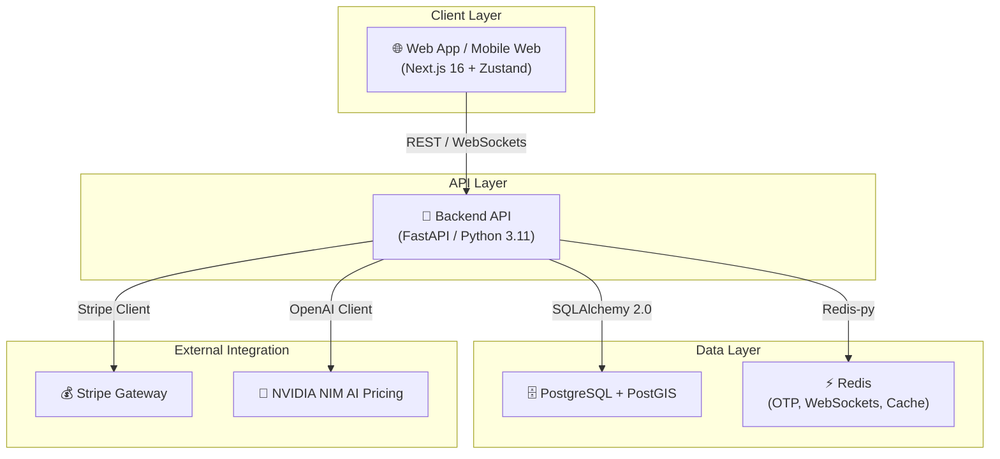

# Архитектура проекта Yolüstü

## Обзор архитектуры

Проект использует клиент-серверную архитектуру с разделением обязанностей на Frontend (Next.js) и Backend (FastAPI).



## Технологический стек

| Компонент | Технология | Обоснование |
|---|---|---|
| **Backend** | **Python 3.11 / FastAPI** | Сверхвысокая скорость работы, поддержка асинхронности, автодокументирование OpenAPI и валидация через Pydantic v2. |
| **Frontend** | **Next.js 16 (App Router)** | Превосходная производительность рендеринга, адаптивная верстка под мобильные устройства и SEO. |
| **База данных** | **PostgreSQL 15 + PostGIS** | Поддержка геопространственных типов данных (Geometry Point) для поиска попутных поездок. |
| **Кэширование** | **Redis** | Быстрое кэширование OTP кодов (TTL 5 мин), сессий, а также оптимизация работы WebSockets. |
| **Эквайринг** | **Stripe API** | Безопасная обработка платежей и автоподтверждение бронирований через Webhooks. |
| **Интеграция ИИ**| **NVIDIA NIM** | Получение интеллектуальных рекомендаций стоимости поездок в реальном времени. |
| **Картография** | **Leaflet.js** | Интерактивные карты без использования платных ключей Google Maps. |

---

## Структура Backend (`backend/app/`)

Бэкенд организован по паттерну модульного монолита. Весь функционал распределен по бизнес-доменам:

```text
backend/app/
├── core/             # Общие модули (настройки, безопасность, БД, WebSockets)
│   ├── config.py     # Чтение переменных окружения
│   ├── database.py   # Сессии SQLAlchemy
│   ├── redis.py      # Клиент Redis
│   ├── security.py   # Хеширование паролей и генерация JWT
│   └── websocket.py  # Менеджер WebSocket подключений (manager)
│
├── domains/          # Бизнес-модули
│   ├── identity/     # Регистрация, профили, СМС OTP, DeviceTokens
│   ├── trips/        # Поездки (Rides), транспорт (Vehicles), геозапросы
│   ├── bookings/     # Бронирование свободных мест
│   ├── engagement/   # Отзывы (Reviews) и чат (Messages)
│   ├── payments/     # Создание сессий Stripe и обработка Webhooks
│   ├── ai/           # Расчет цены с помощью NVIDIA NIM
│   └── admin/        # Управление пользователями, блокировки, модерация
│
└── main.py           # Точка входа в приложение (FastAPI, lifespan, CORS, Exceptions)
```

---

## Жизненный цикл API (FastAPI Lifespan)

Вместо устаревших обработчиков `@app.on_event("startup")` приложение использует современный контекстный менеджер `lifespan`:

```python
@asynccontextmanager
async def lifespan(app: FastAPI):
    # При запуске сервера бэкенда связываем WebSocket менеджер с текущим асинхронным циклом событий
    manager.loop = asyncio.get_running_loop()
    yield
    # При выключении сервера освобождаем занятые ресурсы
```
Это гарантирует корректную маршрутизацию сообщений WebSocket без блокировки основного потока выполнения API.

---

## Особенности Frontend-интеграции

1. **React 19 Compatibility**:
   - Массивы городов Azerbaijan в компоненте `CitySelect.tsx` объявлены как `readonly string[]` для соблюдения неизменяемости данных в React 19.
   - Компонент `TimePicker.tsx` использует React-ссылки `useRef` для отслеживания таймаутов дебаунсинга, защищая от дублирующих запросов и утечек памяти на ре-рендерах.

2. **Leaflet Z-Index & Maps**:
   - Контейнеры карт отрендерены со значением `z-index: 10`. Все выпадающие списки и модальные оверлеи используют `z-[1000]`, что исключает перекрытие интерфейса интерактивными картами.
   - Клик по интерактивной карте автоматически передает координаты в текстовые поля адреса в форме создания поездки.
