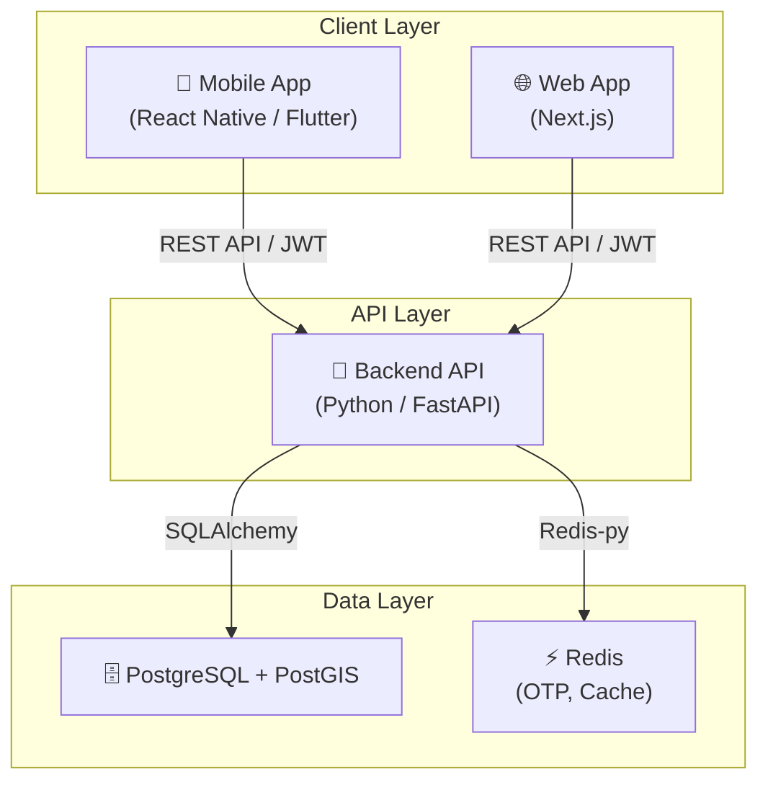

# Архитектура проекта Yolüstü

## Обзор архитектуры

Проект использует архитектуру клиент-сервер с разделением на Frontend (Next.js) и Backend (FastAPI).



## Технологический стек

| Компонент | Технология | Обоснование |
|---|---|---|
| **Backend** | **Python 3.10+ / FastAPI** | Высокая производительность, асинхронность, быстрая разработка. |
| **Frontend** | **Next.js (React)** | SSR/SSG, отличная производительность и SEO. |
| **База данных** | **PostgreSQL 15 + PostGIS** | Надежная реляционная БД с поддержкой геозапросов. |
| **Кэширование** | **Redis** | Хранение OTP кодов, сессий и кэширование. |
| **ORM** | **SQLAlchemy 2.0** | Современная и мощная ORM для работы с БД. |
| **Миграции** | **Alembic** | Стандарт де-факто для миграций в экосистеме SQLAlchemy. |
| **Аутентификация**| **JWT (Jose)** | Безсессионная авторизация, подходящая для мобильных и веб-приложений. |

## Структура Backend (`backend/`)

```
backend/
├── api/              # Эндпоинты API (auth, rides, users и т.д.)
├── core/             # Глобальные настройки, конфиг, БД, Redis
├── models/           # SQLAlchemy модели данных
├── schemas/          # Pydantic схемы (DTO)
├── crud/             # Логика работы с БД (Create, Read, Update, Delete)
├── alembic/          # Скрипты миграций базы данных
├── tests/            # Модульные и интеграционные тесты
└── main.py           # Точка входа в приложение
```

## Поток аутентификации (OTP)

1.  **Запрос OTP:** Пользователь вводит номер телефона. Система генерирует 6-значный код, сохраняет его в Redis с TTL (5 минут) и имитирует отправку SMS.
2.  **Проверка OTP:** Пользователь вводит код. Система сверяет его с кодом в Redis.
3.  **Выдача токена:** При успешном совпадении генерируется JWT (Access + Refresh tokens).

## Безопасность

- Хранение паролей в хешированном виде (Passlib/Bcrypt).
- JWT токены для защиты API эндпоинтов.
- Валидация всех входящих данных через Pydantic.
- CORS политики для ограничения доступа с других доменов.
- Скрытые переменные окружения через `.env`.
