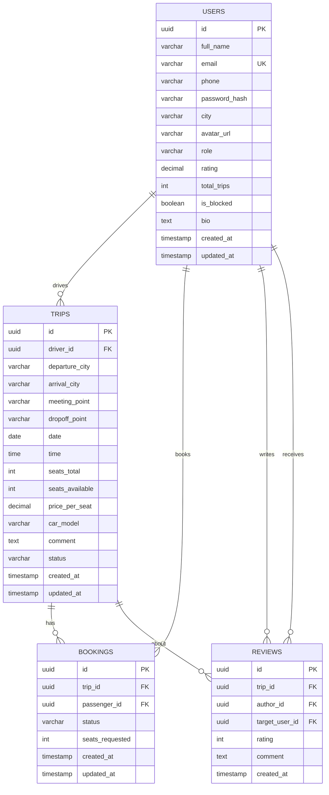

# Database Schema — Yolüstü

## ER Diaqramı

## Cədvəllər

### users

| Sahə | Tip | Məhdudiyyətlər |
|---|---|---|
| id | UUID | PRIMARY KEY, DEFAULT gen_random_uuid() |
| full_name | VARCHAR(100) | NOT NULL |
| email | VARCHAR(255) | NOT NULL, UNIQUE |
| phone | VARCHAR(20) | NOT NULL |
| password_hash | VARCHAR(255) | NOT NULL |
| city | VARCHAR(50) | |
| avatar_url | VARCHAR(500) | |
| role | VARCHAR(20) | DEFAULT 'passenger', CHECK IN ('passenger', 'driver', 'admin') |
| rating | DECIMAL(2,1) | DEFAULT 0 |
| total_trips | INTEGER | DEFAULT 0 |
| is_blocked | BOOLEAN | DEFAULT FALSE |
| bio | TEXT | |
| created_at | TIMESTAMP | DEFAULT NOW() |
| updated_at | TIMESTAMP | DEFAULT NOW() |

**İndekslər:**
- `idx_users_email` ON email
- `idx_users_city` ON city

---

### trips

| Sahə | Tip | Məhdudiyyətlər |
|---|---|---|
| id | UUID | PRIMARY KEY |
| driver_id | UUID | NOT NULL, FOREIGN KEY → users(id) |
| departure_city | VARCHAR(50) | NOT NULL |
| arrival_city | VARCHAR(50) | NOT NULL |
| meeting_point | VARCHAR(200) | |
| dropoff_point | VARCHAR(200) | |
| date | DATE | NOT NULL |
| time | TIME | NOT NULL |
| seats_total | INTEGER | NOT NULL, CHECK (1-4) |
| seats_available | INTEGER | NOT NULL |
| price_per_seat | DECIMAL(6,2) | NOT NULL, CHECK (> 0) |
| car_model | VARCHAR(100) | NOT NULL |
| comment | TEXT | |
| status | VARCHAR(20) | DEFAULT 'active', CHECK IN ('active', 'cancelled', 'completed') |
| created_at | TIMESTAMP | DEFAULT NOW() |
| updated_at | TIMESTAMP | DEFAULT NOW() |

**İndekslər:**
- `idx_trips_driver` ON driver_id
- `idx_trips_route` ON (departure_city, arrival_city)
- `idx_trips_date` ON date
- `idx_trips_status` ON status

---

### bookings

| Sahə | Tip | Məhdudiyyətlər |
|---|---|---|
| id | UUID | PRIMARY KEY |
| trip_id | UUID | NOT NULL, FOREIGN KEY → trips(id) |
| passenger_id | UUID | NOT NULL, FOREIGN KEY → users(id) |
| status | VARCHAR(20) | DEFAULT 'pending', CHECK IN ('pending', 'accepted', 'rejected', 'cancelled', 'completed') |
| seats_requested | INTEGER | NOT NULL, CHECK (>= 1) |
| created_at | TIMESTAMP | DEFAULT NOW() |
| updated_at | TIMESTAMP | DEFAULT NOW() |

**İndekslər:**
- `idx_bookings_trip` ON trip_id
- `idx_bookings_passenger` ON passenger_id
- `idx_bookings_status` ON status

**Constraint:**
- UNIQUE (trip_id, passenger_id) WHERE status NOT IN ('cancelled', 'rejected')

---

### reviews

| Sahə | Tip | Məhdudiyyətlər |
|---|---|---|
| id | UUID | PRIMARY KEY |
| trip_id | UUID | NOT NULL, FOREIGN KEY → trips(id) |
| author_id | UUID | NOT NULL, FOREIGN KEY → users(id) |
| target_user_id | UUID | NOT NULL, FOREIGN KEY → users(id) |
| rating | INTEGER | NOT NULL, CHECK (1-5) |
| comment | TEXT | |
| created_at | TIMESTAMP | DEFAULT NOW() |

**İndekslər:**
- `idx_reviews_target` ON target_user_id
- `idx_reviews_trip` ON trip_id

**Constraint:**
- UNIQUE (trip_id, author_id)
- CHECK (author_id != target_user_id)
