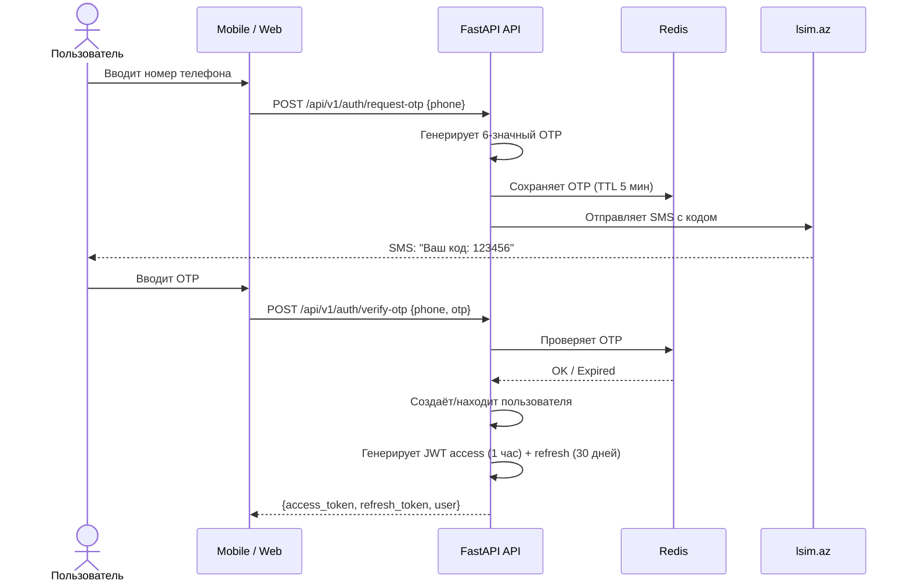
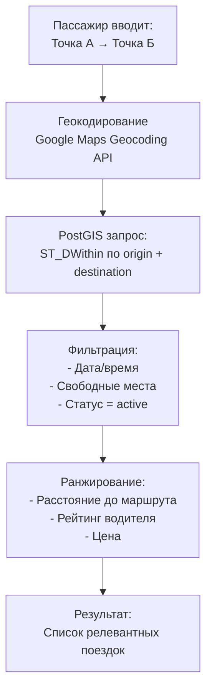
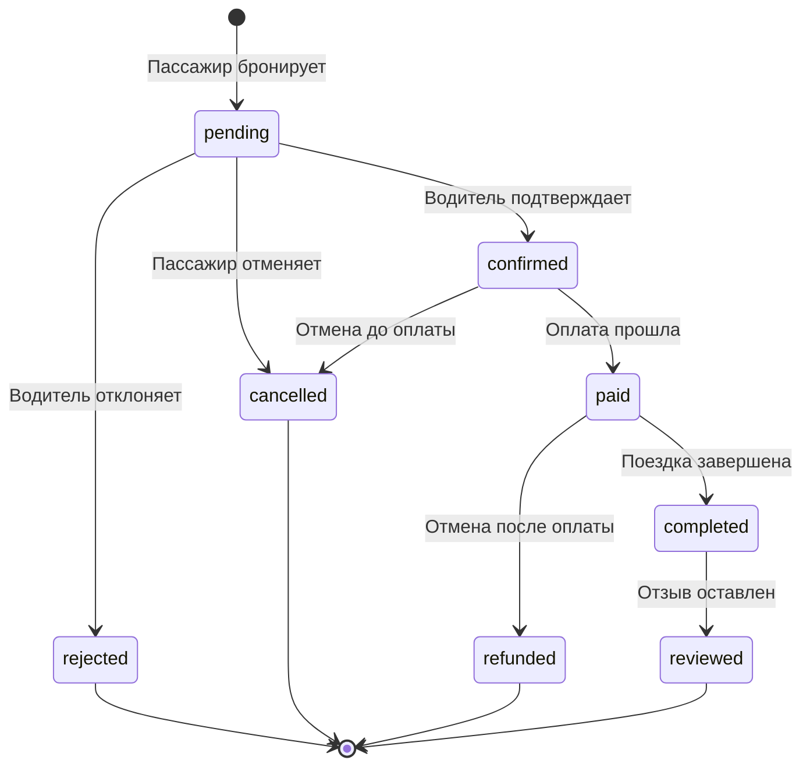
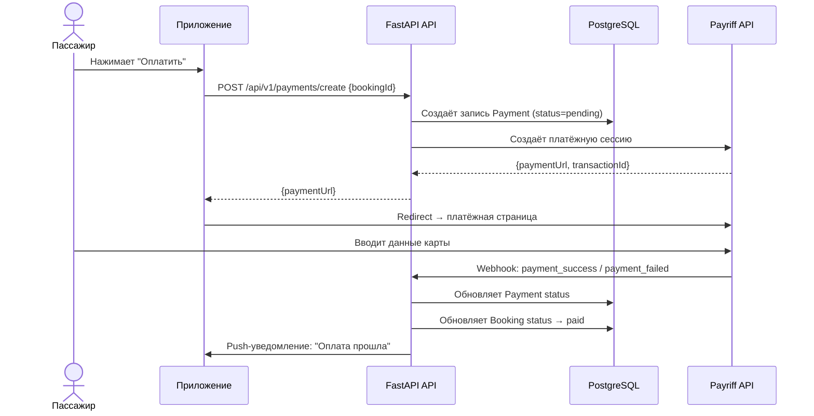
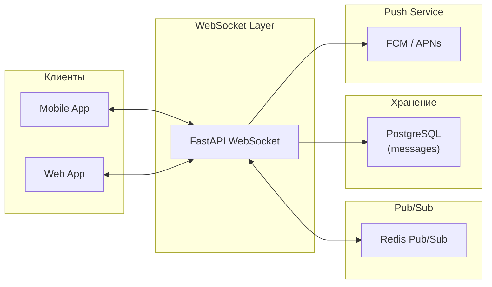

# YolUstu — Архитектурные решения (приложение к дипломной работе)

---

## 1. Выбор архитектурного стиля: Modular Monolith → Microservices

Для MVP выбран подход **Modular Monolith** (модульный монолит) — единое FastAPI-приложение, разделённое на изолированные модули по бизнес-доменам. Это даёт:
- Простоту деплоя (один Docker-контейнер)
- Низкие инфраструктурные затраты на старте
- Возможность выделить модули в микросервисы при росте нагрузки

```
backend/app/
├── core/              # Shared: config, security, database, exceptions
├── domains/           # Бизнес-логика (модули)
│   ├── identity/      # Аутентификация, SMS OTP, JWT, Пользователи
│   ├── trips/         # Поездки (Rides), Транспорт (Vehicles), геопоиск
│   ├── bookings/      # Бронирование
│   ├── engagement/    # Сообщения (Chat), Отзывы (Reviews)
│   └── admin/         # Администрирование
└── main.py            # Точка входа API
```

> Каждый домен инкапсулирует свои models, repositories, services и schemas (DTOs).

---

## 2. Аутентификация: поток SMS OTP + JWT



**Механизм обновления токена:**
- Access token живёт 1 час
- Refresh token живёт 30 дней, хранится в Redis
- При обновлении старый refresh token инвалидируется (rotation)
- При подозрительной активности — все refresh tokens пользователя аннулируются

---

## 3. Геопоиск маршрутов (PostGIS)

Ключевая архитектурная задача — найти поездки, маршрут которых проходит «по пути» пассажира.

### Алгоритм поиска



**SQL-запрос (через SQLAlchemy + GeoAlchemy2):**
```python
query = db.query(Ride).filter(
    Ride.status == "active",
    func.ST_DWithin(Ride.origin_location, origin_geom, radius),
    func.ST_DWithin(Ride.destination_location, dest_geom, radius)
).order_by(func.ST_Distance(Ride.origin_location, origin_geom) + func.ST_Distance(Ride.destination_location, dest_geom))
```

**Индексы:**
```sql
CREATE INDEX idx_rides_origin_geo ON rides USING GIST (origin_location);
CREATE INDEX idx_rides_dest_geo ON rides USING GIST (destination_location);
CREATE INDEX idx_rides_departure ON rides (departure_time) WHERE status = 'active';
```

---

## 4. Поток бронирования (Booking Flow)



---

## 5. Платёжная архитектура



---

## 6. Real-Time архитектура (чат + уведомления)



---

## 7. Кэширование

| Что кэшируется | Хранилище | TTL | Стратегия инвалидации |
|---|---|---|---|
| Сессии / Refresh tokens | Redis | 30 дней | Удаление при logout |
| OTP коды | Redis | 5 мин | Auto-expire |
| Популярные маршруты | Redis | 1 час | Invalidate при новой поездке |
| Профили пользователей | Redis | 15 мин | Invalidate при обновлении |

---

## 8. Обработка ошибок и устойчивость

### Centralized Error Handling

Все необработанные исключения перехватываются глобальным обработчиком и возвращаются в формате:
```json
{
  "success": false,
  "error": {
    "code": "BOOKING_NO_SEATS",
    "message": "Нет свободных мест",
    "timestamp": "2026-05-06T12:00:00Z"
  }
}
```

---

## 9. Безопасность

| Аспект | Реализация |
|---|---|
| **Аутентификация** | JWT (HS256), access + refresh token rotation |
| **Авторизация** | RBAC: user, driver, admin. FastAPI Depends |
| **HTTPS** | Обязательный TLS (Let's Encrypt / Nginx) |
| **Rate Limiting** | Redis-based rate limiting |
| **Input Validation** | Pydantic v2 |
| **SQL Injection** | SQLAlchemy — параметризованные запросы |

---

## 10. Observability (наблюдаемость)

| Инструмент | Назначение |
|---|---|
| **Logging** | Structured JSON logging |
| **Sentry** | Error tracking & performance |
| **Prometheus** | API Metrics |

---

## 11. API Design (REST)

### Версионирование
Все эндпоинты под префиксом `/api/v1/`.

### Формат ответов
```json
{
  "success": true,
  "data": { ... },
  "meta": {
    "page": 1,
    "total": 142
  }
}
```
