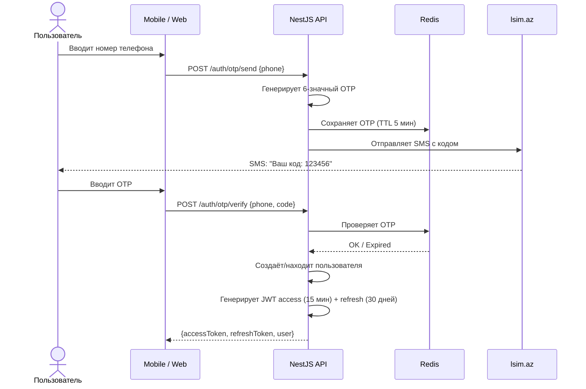
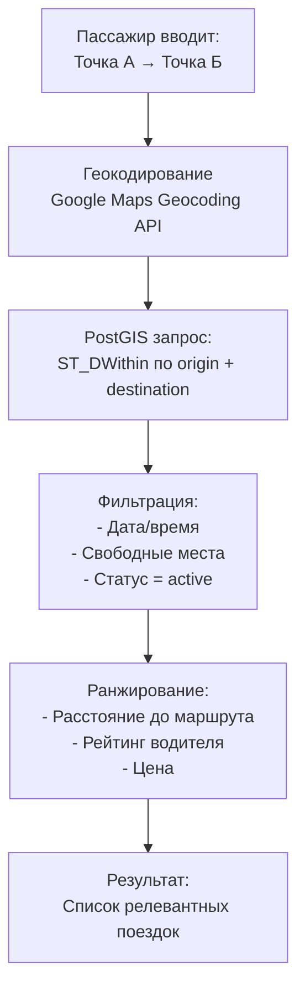
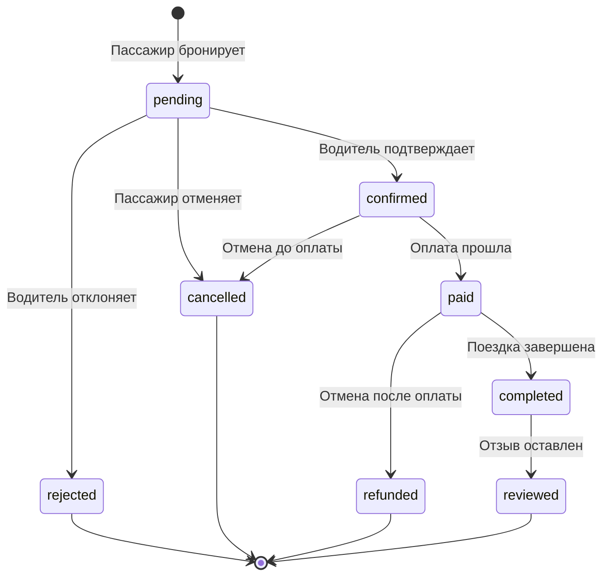
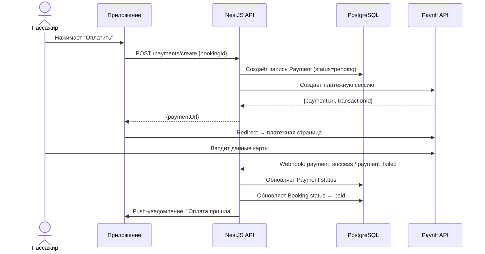
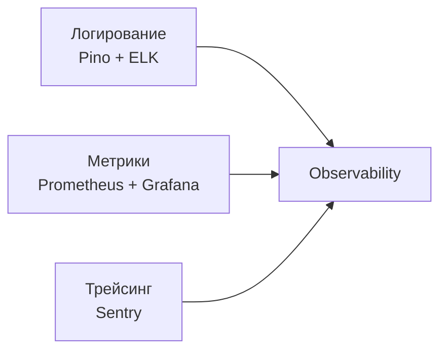
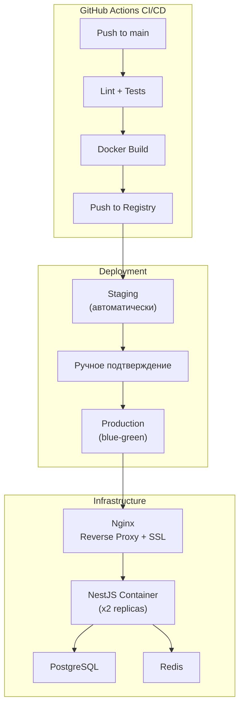

# YolUstu — Архитектурные решения (приложение к дипломной работе)

---

## 1. Выбор архитектурного стиля: Modular Monolith → Microservices

Для MVP выбран подход **Modular Monolith** (модульный монолит) — единое NestJS-приложение, разделённое на изолированные модули по бизнес-доменам. Это даёт:
- Простоту деплоя (один Docker-контейнер)
- Низкие инфраструктурные затраты на старте
- Возможность выделить модули в микросервисы при росте нагрузки

```
src/
├── modules/
│   ├── auth/          # Аутентификация, SMS OTP, JWT
│   ├── users/         # Профили, верификация KYC
│   ├── rides/         # Поездки, геопоиск
│   ├── bookings/      # Бронирование
│   ├── payments/      # Интеграция с Payriff
│   ├── chat/          # WebSocket чат
│   ├── notifications/ # Push, SMS
│   └── reviews/       # Рейтинги и отзывы
├── common/            # Shared: guards, pipes, filters, DTOs
├── config/            # Конфигурация (env, database)
└── main.ts
```

> Каждый модуль инкапсулирует свои controllers, services, repositories и DTOs. Модули общаются через dependency injection, не через прямые импорты внутренних классов.

---

## 2. Аутентификация: поток SMS OTP + JWT



**Механизм обновления токена:**
- Access token живёт 15 минут
- Refresh token живёт 30 дней, хранится в Redis
- При обновлении старый refresh token инвалидируется (rotation)
- При подозрительной активности — все refresh tokens пользователя аннулируются

---

## 3. Геопоиск маршрутов (PostGIS)

Ключевая архитектурная задача — найти поездки, маршрут которых проходит «по пути» пассажира.

### Алгоритм поиска



**SQL-запрос (упрощённый):**
```sql
SELECT r.*, u.first_name, u.rating,
       ST_Distance(r.origin_location, ST_SetSRID(ST_MakePoint(:lng1, :lat1), 4326)) AS origin_dist,
       ST_Distance(r.destination_location, ST_SetSRID(ST_MakePoint(:lng2, :lat2), 4326)) AS dest_dist
FROM rides r
JOIN users u ON r.driver_id = u.id
WHERE r.status = 'active'
  AND r.departure_time > NOW()
  AND r.available_seats >= :seats
  AND ST_DWithin(
      r.origin_location::geography,
      ST_SetSRID(ST_MakePoint(:lng1, :lat1), 4326)::geography,
      :radius_meters  -- например, 15000 (15 км)
  )
  AND ST_DWithin(
      r.destination_location::geography,
      ST_SetSRID(ST_MakePoint(:lng2, :lat2), 4326)::geography,
      :radius_meters
  )
ORDER BY origin_dist + dest_dist ASC, u.rating DESC
LIMIT 20;
```

**Индексы:**
```sql
CREATE INDEX idx_rides_origin_geo ON rides USING GIST (origin_location);
CREATE INDEX idx_rides_dest_geo ON rides USING GIST (destination_location);
CREATE INDEX idx_rides_departure ON rides (departure_time) WHERE status = 'active';
```

---

## 4. Поток бронирования (Booking Flow)



Смена статуса сопровождается:
1. Обновлением `available_seats` в таблице `rides`
2. Push-уведомлением обеим сторонам
3. Записью в лог событий (audit trail)

---

## 5. Платёжная архитектура



**Безопасность платежей:**
- API не хранит данные банковских карт (PCI DSS compliance)
- Webhook от Payriff верифицируется через подпись (HMAC)
- Идемпотентность: повторный webhook не создаёт дублей

---

## 6. Real-Time архитектура (чат + уведомления)


**Логика доставки сообщений:**
1. Клиент отправляет сообщение через WebSocket
2. Сервер сохраняет в PostgreSQL
3. Сервер публикует в Redis Pub/Sub (для горизонтального масштабирования)
4. Если получатель онлайн → доставка через WebSocket
5. Если получатель офлайн → Push-уведомление через FCM/APNs

**Комнаты чата:**
- Каждая поездка = одна комната (`ride:{rideId}`)
- Только водитель и подтверждённые пассажиры имеют доступ

---

## 7. Кэширование

| Что кэшируется | Хранилище | TTL | Стратегия инвалидации |
|---|---|---|---|
| Сессии / Refresh tokens | Redis | 30 дней | Удаление при logout |
| OTP коды | Redis | 5 мин | Auto-expire |
| Популярные маршруты | Redis | 1 час | Invalidate при новой поездке |
| Профили пользователей | Redis | 15 мин | Invalidate при обновлении |
| Результаты геопоиска | Не кэшируются | — | Данные слишком динамичны |

---

## 8. Обработка ошибок и устойчивость

### Centralized Error Handling (NestJS Exception Filter)

```
Все ошибки → GlobalExceptionFilter → стандартный JSON-ответ:
{
  "statusCode": 400,
  "error": "BOOKING_NO_SEATS",
  "message": "Нет свободных мест",
  "timestamp": "2026-05-06T12:00:00Z"
}
```

### Retry-политика для внешних сервисов

| Сервис | Стратегия | Max retries |
|---|---|---|
| SMS Gateway (lsim.az) | Exponential backoff | 3 |
| Payriff API | Exponential backoff + fallback | 3 |
| Google Maps API | Retry + circuit breaker | 2 |
| FCM Push | Fire-and-forget с логированием | 1 |

### Circuit Breaker
При последовательных ошибках внешнего сервиса (>5 за 30 сек) — circuit открывается, запросы возвращают fallback-ответ. Через 60 сек — пробный запрос (half-open).

---

## 9. Безопасность

| Аспект | Реализация |
|---|---|
| **Аутентификация** | JWT (RS256), access + refresh token rotation |
| **Авторизация** | RBAC: user, driver, admin. Guard-декораторы NestJS |
| **HTTPS** | Обязательный TLS на всех эндпоинтах (Let's Encrypt) |
| **Rate Limiting** | 100 req/min на IP (nestjs-throttler) |
| **Input Validation** | class-validator + class-transformer (DTO pipes) |
| **SQL Injection** | Prisma ORM — параметризованные запросы |
| **XSS** | Санитизация пользовательского ввода, CSP headers |
| **CORS** | Whitelist разрешённых доменов |
| **Загрузка файлов** | Проверка MIME-type, ограничение 5 MB, S3 presigned URLs |
| **Данные карт** | Не хранятся на сервере (PCI DSS через Payriff) |

---

## 10. Observability (наблюдаемость)

### Три столпа



| Инструмент | Назначение |
|---|---|
| **Pino** (структурированный JSON) | Логирование запросов, ошибок, бизнес-событий |
| **Prometheus** | Сбор метрик (RPS, latency, error rate) |
| **Grafana** | Визуализация дашбордов |
| **Sentry** | Трекинг ошибок и performance (traces) |

### Ключевые метрики для мониторинга
- `http_request_duration_seconds` — латентность API
- `rides_created_total` — счётчик созданных поездок
- `bookings_total` — счётчик бронирований по статусам
- `payments_total` — счётчик платежей (success/failed)
- `ws_connections_active` — активные WebSocket-соединения

---

## 11. Стратегия деплоя



**Docker Compose (production):**
- `api` — NestJS (2 реплики за Nginx)
- `web` — Next.js (SSR)
- `postgres` — PostgreSQL 15 + PostGIS
- `redis` — Redis 7
- `nginx` — Reverse proxy, SSL termination

---

## 12. API Design (REST)

### Версионирование
Все эндпоинты под префиксом `/api/v1/`. При breaking changes — `/api/v2/`.

### Основные эндпоинты

| Метод | Путь | Описание |
|---|---|---|
| POST | `/auth/otp/send` | Отправить OTP |
| POST | `/auth/otp/verify` | Верифицировать OTP |
| POST | `/auth/refresh` | Обновить access token |
| GET | `/users/me` | Текущий профиль |
| PUT | `/users/me` | Обновить профиль |
| POST | `/rides` | Создать поездку |
| GET | `/rides/search` | Поиск поездок (геопоиск) |
| GET | `/rides/:id` | Детали поездки |
| POST | `/bookings` | Забронировать место |
| PATCH | `/bookings/:id/confirm` | Подтвердить бронирование |
| POST | `/payments/create` | Создать платёж |
| GET | `/reviews/user/:id` | Отзывы о пользователе |
| POST | `/reviews` | Оставить отзыв |

### Формат ответов
```json
{
  "success": true,
  "data": { ... },
  "meta": {
    "page": 1,
    "perPage": 20,
    "total": 142
  }
}
```

### Пагинация
Cursor-based для списков поездок (высокая производительность при больших объёмах):
```
GET /rides/search?cursor=eyJpZCI6MTIzfQ&limit=20
```
