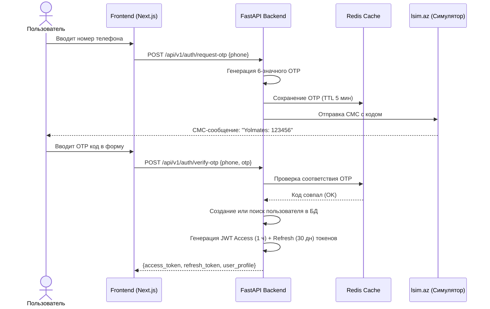
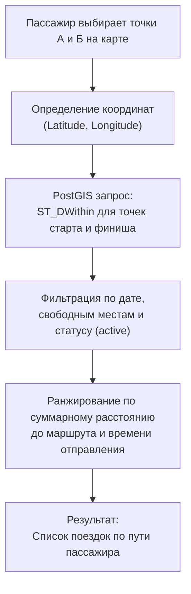
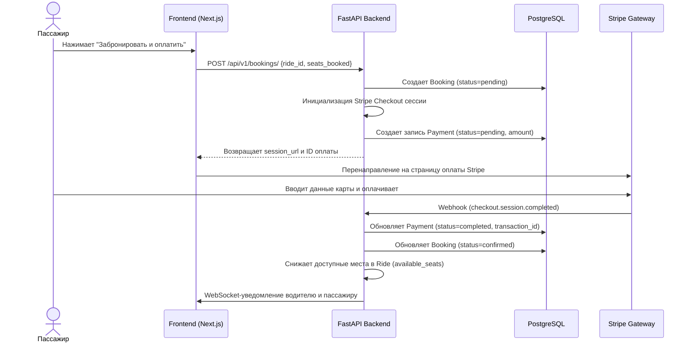

# Yolmates — Архитектурные решения (приложение к дипломной работе)

---

## 1. Архитектурный стиль: Modular Monolith

Для проекта выбран подход **Modular Monolith** (модульный монолит) — единое FastAPI-приложение, разделенное на изолированные модули по бизнес-доменам. Это дает простоту разработки и развертывания при сохранении четких границ между компонентами для последующего безболезненного выделения в микросервисы.

```
backend/app/
├── core/              # Shared: config, security, database, exceptions, websocket
├── domains/           # Бизнес-логика (модули по доменам)
│   ├── identity/      # Аутентификация, SMS OTP, JWT, Пользователи, DeviceTokens
│   ├── trips/         # Поездки (Rides), Транспорт (Vehicles), геопоиск PostGIS
│   ├── bookings/      # Бронирование поездок
│   ├── engagement/    # Чат (Messages), Отзывы (Reviews)
│   ├── payments/      # Платёжная интеграция (Stripe)
│   └── ai/            # ИИ-расчет цен (NVIDIA NIM LLaMA-3.1)
└── main.py            # Точка входа API и конфигурация middleware
```

Каждый домен инкапсулирует свои модели баз данных (`models.py`), схемы валидации Pydantic (`schemas.py`), роутеры (`router.py`/`*_router.py`) и бизнес-сервисы (`services.py`).

---

## 2. Аутентификация: поток SMS OTP + JWT

Аутентификация построена без сессий на базе JWT токенов. Для входа используется номер телефона с подтверждением по одноразовому коду (OTP).



При истечении Access Token, клиент отправляет запрос на `/api/v1/auth/refresh` с Refresh Token для получения новой пары ключей без повторного ввода СМС-кода.

---

## 3. Геопоиск маршрутов (PostGIS)

Поиск подходящих поездок осуществляется по географическим координатам начальной и конечной точек с использованием расширения **PostGIS** для PostgreSQL.

### Алгоритм поиска



### SQL-запрос поиска по радиусу (SQLAlchemy + GeoAlchemy2):
```python
# Фильтрация поездок, проходящих в радиусе N метров от точек отправления и прибытия пассажира
query = db.query(Ride).filter(
    Ride.status == "active",
    Ride.available_seats >= min_seats,
    func.ST_DWithin(Ride.origin_location, origin_geom, radius_meters),
    func.ST_DWithin(Ride.destination_location, dest_geom, radius_meters)
)
```

В таблице `rides` созданы пространственные индексы `GIST` на колонки `origin_location` и `destination_location` для мгновенного выполнения пространственных запросов.

---

## 4. Поток бронирования и оплаты (Stripe Flow)

Бронирование места пассажиром связано с холдированием оплаты. Интеграция Stripe обеспечивает безопасность сделки.



---

## 5. Real-Time коммуникации (Чат и уведомления)

Внутригрупповой чат для участников поездки и системные уведомления о бронированиях работают на базе технологии **WebSockets**.

- **WebSocket Connection Manager**: Централизованный сервис (`app/core/websocket.py`), отслеживающий активные соединения в комнатах поездок (`ws/contacts`).
- **Redis Pub/Sub**: Обеспечивает масштабирование чата. Сообщения, отправленные на один экземпляр бэкенда, транслируются на другие узлы через каналы Redis.
- **Жизненный цикл API**: FastAPI инициализирует асинхронный event loop с помощью `lifespan` контекст-менеджера:
  ```python
  @asynccontextmanager
  async def lifespan(app: FastAPI):
      # Инициализируем loop для WebSocket менеджера в контексте запущенного asyncio
      manager.loop = asyncio.get_running_loop()
      yield
  ```
  Это предотвращает зависание или потерю событий при конкурентном подключении сотен клиентов.

---

## 6. База данных: Отношения и Ограничения

```mermaid
erDiagram
    USERS ||--o{ VEHICLES : "owns"
    USERS ||--o{ RIDES : "drives"
    USERS ||--o{ BOOKINGS : "books"
    USERS ||--o{ REVIEWS : "writes/receives"
    USERS ||--o{ DEVICE_TOKENS : "registers"
    RIDES ||--o{ BOOKINGS : "has"
    RIDES ||--o{ MESSAGES : "contains"
    RIDES ||--o{ REVIEWS : "evaluated"
    BOOKINGS ||--o1 PAYMENTS : "paid_by"

    USERS {
        uuid id PK
        string phone UK
        string first_name
        string last_name
        string role
        float rating
        boolean is_verified
    }
    VEHICLES {
        uuid id PK
        uuid user_id FK
        string brand
        string model
        string plate_number
    }
    RIDES {
        uuid id PK
        uuid driver_id FK
        uuid vehicle_id FK
        point origin_location
        point destination_location
        datetime departure_time
        int available_seats
        float price_per_seat
    }
    BOOKINGS {
        uuid id PK
        uuid ride_id FK
        uuid passenger_id FK
        string status
        int seats_booked
    }
    PAYMENTS {
        uuid id PK
        uuid booking_id FK
        float amount
        string status
        string transaction_id
    }
```

---

## 7. Фронтенд: Особенности интеграции

### 7.1 Совместимость с React 19
В интерфейсе Next.js 16 применены строгие типизации под требования React 19:
- Выпадающий список городов `CitySelect.tsx` оперирует только с неизменяемыми свойствами (`readonly string[]`), защищая UI от мутаций.
- Выбор времени `TimePicker.tsx` использует `useRef` для сохранения ID таймеров дебаунса, что исключает утечки таймеров и повторные вызовы API на ре-рендерах.

### 7.2 Интерактивные карты Leaflet
- Контейнеры карт отрендерены с корректными уровнями перекрытия (`z-index: 10` для карты, `z-[1000]` для модальных окон и выпадающих меню городов), предотвращая ситуации, когда интерактивная карта перекрывает селекторы маршрута.
- Клик по карте автоматически синхронизирует координаты точек с текстовыми полями "Meeting Point" и "Dropoff Point" для удобства ручной корректировки.
