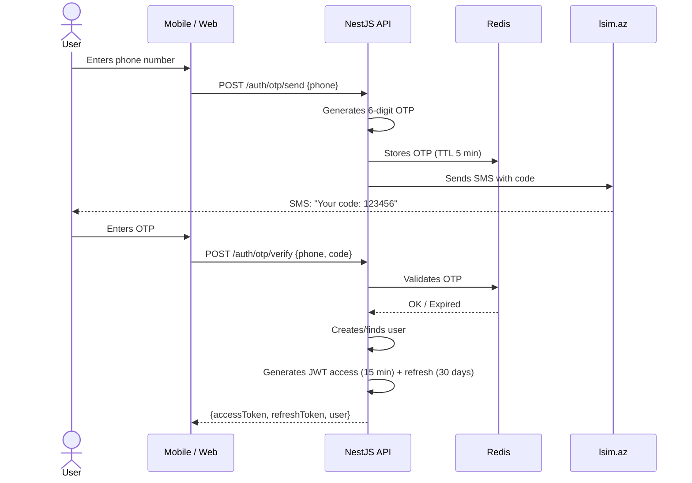
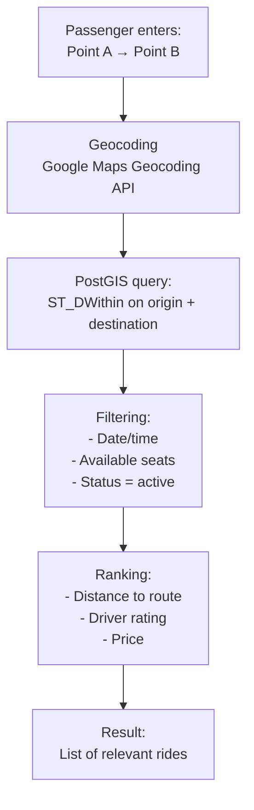
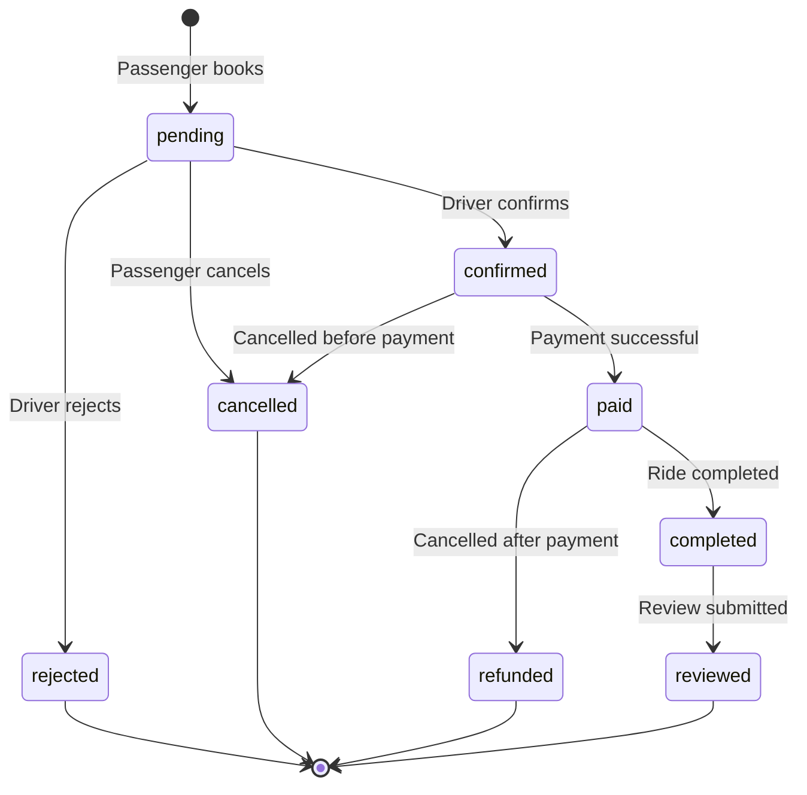
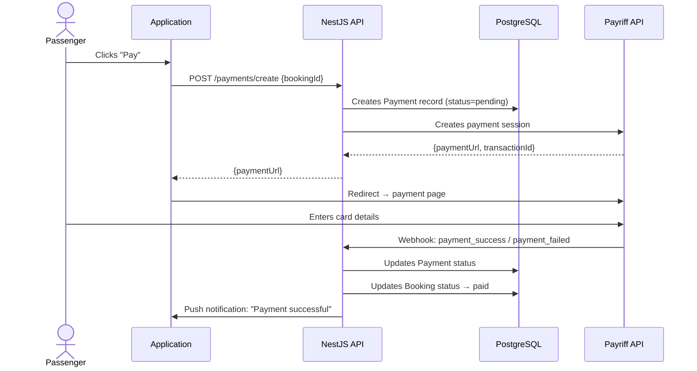
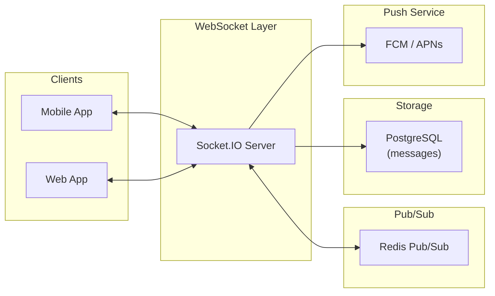
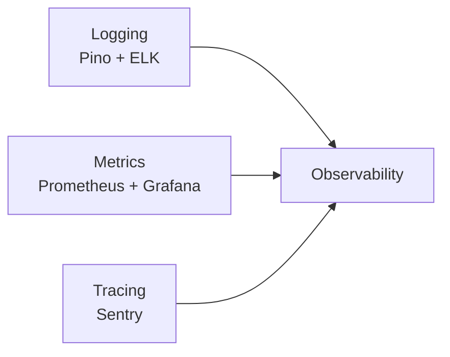
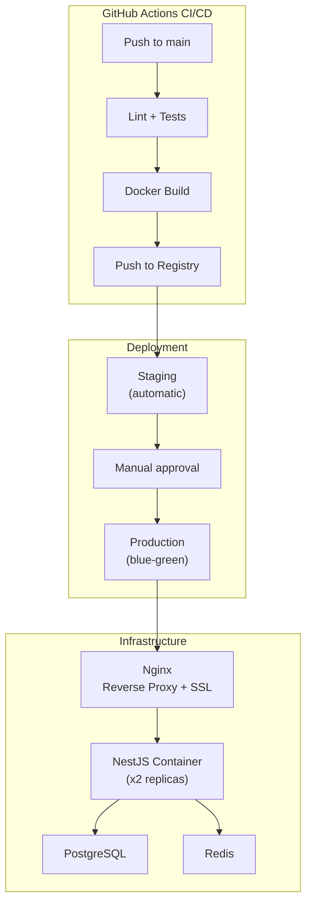

# YolUstu — Architectural Decisions (Diploma Work Appendix)

---

## 1. Architectural Style: Modular Monolith → Microservices

For the MVP, the **Modular Monolith** approach is chosen — a single NestJS application divided into isolated modules by business domains. This provides:
- Simple deployment (one Docker container)
- Low infrastructure costs at the start
- Ability to extract modules into microservices as load grows

```
src/
├── modules/
│   ├── auth/          # Authentication, SMS OTP, JWT
│   ├── users/         # Profiles, KYC verification
│   ├── rides/         # Rides, geo-search
│   ├── bookings/      # Booking
│   ├── payments/      # Payriff integration
│   ├── chat/          # WebSocket chat
│   ├── notifications/ # Push, SMS
│   └── reviews/       # Ratings and reviews
├── common/            # Shared: guards, pipes, filters, DTOs
├── config/            # Configuration (env, database)
└── main.ts
```

> Each module encapsulates its own controllers, services, repositories, and DTOs. Modules communicate via dependency injection, not through direct imports of internal classes.

---

## 2. Authentication: SMS OTP + JWT Flow



**Token refresh mechanism:**
- Access token lives 15 minutes
- Refresh token lives 30 days, stored in Redis
- On refresh, the old refresh token is invalidated (rotation)
- On suspicious activity — all user refresh tokens are revoked

---

## 3. Geo-Search for Rides (PostGIS)

The key architectural challenge is finding rides whose route goes "along the way" for a passenger.

### Search Algorithm



**SQL query (simplified):**
```sql
SELECT r.*, u.first_name, u.rating,
       ST_Distance(r.origin_location, ST_SetSRID(ST_MakePoint(:lng1, :lat1), 4326)) AS origin_dist,
       ST_Distance(r.destination_location, ST_SetSRID(ST_MakePoint(:lng2, :lat2), 4326)) AS dest_dist
FROM rides r
JOIN users u ON r.driver_id = u.id
WHERE r.status = 'active'
  AND r.departure_time > NOW()
  AND r.available_seats >= :seats
  AND ST_DWithin(
      r.origin_location::geography,
      ST_SetSRID(ST_MakePoint(:lng1, :lat1), 4326)::geography,
      :radius_meters  -- e.g., 15000 (15 km)
  )
  AND ST_DWithin(
      r.destination_location::geography,
      ST_SetSRID(ST_MakePoint(:lng2, :lat2), 4326)::geography,
      :radius_meters
  )
ORDER BY origin_dist + dest_dist ASC, u.rating DESC
LIMIT 20;
```

**Indexes:**
```sql
CREATE INDEX idx_rides_origin_geo ON rides USING GIST (origin_location);
CREATE INDEX idx_rides_dest_geo ON rides USING GIST (destination_location);
CREATE INDEX idx_rides_departure ON rides (departure_time) WHERE status = 'active';
```

---

## 4. Booking Flow



Status changes are accompanied by:
1. Updating `available_seats` in the `rides` table
2. Push notification to both parties
3. Entry in the event log (audit trail)

---

## 5. Payment Architecture



**Payment security:**
- API does not store bank card data (PCI DSS compliance)
- Webhook from Payriff is verified via signature (HMAC)
- Idempotency: repeated webhook does not create duplicates

---

## 6. Real-Time Architecture (Chat + Notifications)



**Message delivery logic:**
1. Client sends a message via WebSocket
2. Server saves it to PostgreSQL
3. Server publishes to Redis Pub/Sub (for horizontal scaling)
4. If recipient is online → delivery via WebSocket
5. If recipient is offline → Push notification via FCM/APNs

**Chat rooms:**
- Each ride = one room (`ride:{rideId}`)
- Only the driver and confirmed passengers have access

---

## 7. Caching

| What is cached | Storage | TTL | Invalidation strategy |
|---|---|---|---|
| Sessions / Refresh tokens | Redis | 30 days | Delete on logout |
| OTP codes | Redis | 5 min | Auto-expire |
| Popular routes | Redis | 1 hour | Invalidate on new ride |
| User profiles | Redis | 15 min | Invalidate on update |
| Geo-search results | Not cached | — | Data is too dynamic |

---

## 8. Error Handling and Resilience

### Centralized Error Handling (NestJS Exception Filter)

```
All errors → GlobalExceptionFilter → standard JSON response:
{
  "statusCode": 400,
  "error": "BOOKING_NO_SEATS",
  "message": "No available seats",
  "timestamp": "2026-05-06T12:00:00Z"
}
```

### Retry Policy for External Services

| Service | Strategy | Max retries |
|---|---|---|
| SMS Gateway (lsim.az) | Exponential backoff | 3 |
| Payriff API | Exponential backoff + fallback | 3 |
| Google Maps API | Retry + circuit breaker | 2 |
| FCM Push | Fire-and-forget with logging | 1 |

### Circuit Breaker
On consecutive errors from an external service (>5 in 30 sec) — the circuit opens, requests return a fallback response. After 60 sec — a probe request (half-open).

---

## 9. Security

| Aspect | Implementation |
|---|---|
| **Authentication** | JWT (RS256), access + refresh token rotation |
| **Authorization** | RBAC: user, driver, admin. NestJS guard decorators |
| **HTTPS** | Mandatory TLS on all endpoints (Let's Encrypt) |
| **Rate Limiting** | 100 req/min per IP (nestjs-throttler) |
| **Input Validation** | class-validator + class-transformer (DTO pipes) |
| **SQL Injection** | Prisma ORM — parameterized queries |
| **XSS** | User input sanitization, CSP headers |
| **CORS** | Whitelist of allowed domains |
| **File Uploads** | MIME-type validation, 5 MB limit, S3 presigned URLs |
| **Card Data** | Not stored on the server (PCI DSS via Payriff) |

---

## 10. Observability

### Three Pillars



| Tool | Purpose |
|---|---|
| **Pino** (structured JSON) | Logging requests, errors, business events |
| **Prometheus** | Collecting metrics (RPS, latency, error rate) |
| **Grafana** | Dashboard visualization |
| **Sentry** | Error tracking and performance (traces) |

### Key Metrics to Monitor
- `http_request_duration_seconds` — API latency
- `rides_created_total` — ride creation counter
- `bookings_total` — booking counter by status
- `payments_total` — payment counter (success/failed)
- `ws_connections_active` — active WebSocket connections

---

## 11. Deployment Strategy



**Docker Compose (production):**
- `api` — NestJS (2 replicas behind Nginx)
- `web` — Next.js (SSR)
- `postgres` — PostgreSQL 15 + PostGIS
- `redis` — Redis 7
- `nginx` — Reverse proxy, SSL termination

---

## 12. API Design (REST)

### Versioning
All endpoints under the `/api/v1/` prefix. On breaking changes — `/api/v2/`.

### Main Endpoints

| Method | Path | Description |
|---|---|---|
| POST | `/auth/otp/send` | Send OTP |
| POST | `/auth/otp/verify` | Verify OTP |
| POST | `/auth/refresh` | Refresh access token |
| GET | `/users/me` | Current profile |
| PUT | `/users/me` | Update profile |
| POST | `/rides` | Create a ride |
| GET | `/rides/search` | Search rides (geo-search) |
| GET | `/rides/:id` | Ride details |
| POST | `/bookings` | Book a seat |
| PATCH | `/bookings/:id/confirm` | Confirm booking |
| POST | `/payments/create` | Create payment |
| GET | `/reviews/user/:id` | User reviews |
| POST | `/reviews` | Submit a review |

### Response Format
```json
{
  "success": true,
  "data": { ... },
  "meta": {
    "page": 1,
    "perPage": 20,
    "total": 142
  }
}
```

### Pagination
Cursor-based for ride lists (high performance at scale):
```
GET /rides/search?cursor=eyJpZCI6MTIzfQ&limit=20
```
