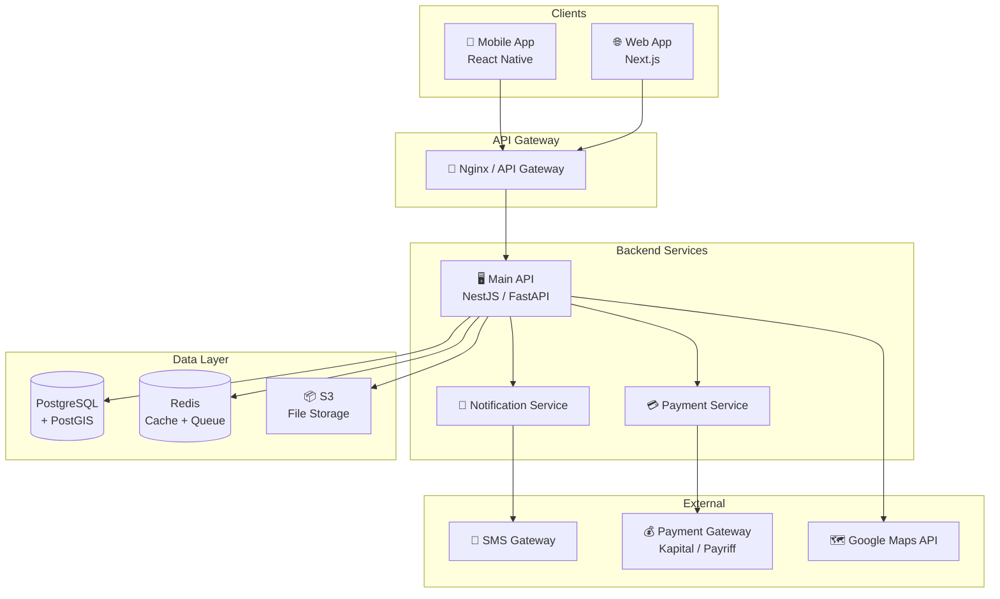
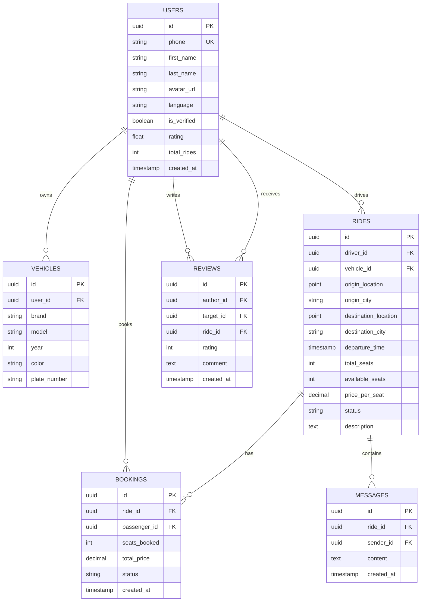

# 🚗 YolUstu — Project Plan

> Carpooling platform for Azerbaijan (BlaBlaCar analogue)

---

## 1. Product Overview

| Parameter | Description |
|---|---|
| **Name** | YolUstu (Yol Üstü — "On the Way") |
| **Concept** | Mobile app + web platform for finding and offering carpooling rides across Azerbaijan |
| **Target Audience** | Drivers and passengers traveling between Azerbaijani cities (Baku ↔ Ganja, Baku ↔ Lankaran, Baku ↔ Sheki, etc.) |
| **Problem** | No convenient digital service for finding carpool rides. People search through WhatsApp groups, Telegram, and word of mouth |
| **Solution** | Centralized platform with verification, ratings, online payments, and convenient search |

---

## 2. Key Features (MVP)

### 2.1 For Passengers
- 🔍 Search rides by route, date, and time
- 📍 Specify intermediate pickup/drop-off points
- 💳 Online booking and payment
- ⭐ Driver ratings and reviews
- 💬 Chat with driver after booking
- 🔔 Push notifications about ride status

### 2.2 For Drivers
- ➕ Publish a ride (route, date, time, price, number of seats)
- 🔄 Recurring rides (regular routes)
- ✅ Approve / reject passengers
- 💰 Receive payment to card / balance
- ⭐ Passenger ratings and reviews

### 2.3 General
- 📱 Registration via phone number (SMS OTP)
- 🪪 Identity verification (ID photo + selfie)
- 🗺️ Interactive route map
- 🌐 Multilingual: Azerbaijani (primary), Russian, English

---

## 3. Post-MVP Features (v2+)

- 🚕 Regular routes with automatic ride creation
- 👥 Group rides (multiple passengers — one driver)
- 🏆 Loyalty program and promo codes
- 📊 Driver analytics (earnings, statistics)
- 🔗 Integration with ASAN card (government verification)
- 🚌 Partnership with bus companies
- 📦 Parcel delivery along the way
- 🆘 SOS button and real-time ride tracking

---

## 4. Tech Stack

### 4.1 Mobile Apps
| Component | Technology | Rationale |
|---|---|---|
| Framework | **React Native** or **Flutter** | Single codebase for iOS + Android, fast time-to-market |
| Navigation | React Navigation / GoRouter | — |
| State Management | Zustand / Riverpod | Simplicity and performance |
| Maps | **Google Maps SDK** | Good coverage of Azerbaijan |

### 4.2 Backend
| Component | Technology | Rationale |
|---|---|---|
| API | **Node.js + NestJS** or **Python + FastAPI** | Rapid development, strong ecosystem |
| Database | **PostgreSQL** | Reliability, PostGIS for geo-queries |
| Cache | **Redis** | Sessions, route caching |
| Queues | **BullMQ** (Redis) | Notifications, email, SMS |
| Storage | **AWS S3** / **MinIO** | Profile photos, documents |
| Search | **PostGIS** + PostgreSQL | Geospatial ride search |

### 4.3 Web Application
| Component | Technology |
|---|---|
| Framework | **Next.js** (React) |
| UI | Tailwind CSS + Shadcn/UI |
| Maps | Google Maps JS API |

### 4.4 Infrastructure
| Component | Technology |
|---|---|
| Hosting | **AWS** / **DigitalOcean** |
| CI/CD | GitHub Actions |
| Containerization | Docker + Docker Compose |
| Monitoring | Sentry + Grafana |
| SMS Provider | **Azerbaijani SMS gateway** (e.g., lsim.az or oxu SMS) |
| Payments | **Kapital Bank e-commerce** or **Payriff** (MilliÖn) |

---

## 5. Architecture (High-Level)

---

## 6. Database Schema (Key Tables)

---

## 7. Development Phases

### Phase 1 — Foundation (6–8 weeks)
| # | Task | Verification |
|---|---|---|
| 1 | Project setup (monorepo, CI/CD, Docker) | `docker compose up` starts everything |
| 2 | Data model + PostgreSQL migrations | Migrations pass, tables are created |
| 3 | Authentication (SMS OTP, JWT) | Can register and log in via SMS |
| 4 | CRUD API for rides | Can create, find, edit, delete a ride |
| 5 | Geo-search for rides (PostGIS) | Route search returns relevant rides |

### Phase 2 — Core Functionality (6–8 weeks)
| # | Task | Verification |
|---|---|---|
| 1 | Booking system | Passenger books a seat → status updates |
| 2 | Chat between driver and passenger | Messages delivered in real time (WebSocket) |
| 3 | Push notifications (FCM / APNs) | Notifications arrive on booking, cancellation, message |
| 4 | Ratings and reviews | Can leave a review after a ride |
| 5 | User profile + verification | Document upload, moderation |

### Phase 3 — Payments & Mobile App (6–8 weeks)
| # | Task | Verification |
|---|---|---|
| 1 | Payriff / Kapital Bank integration | Test payment goes through |
| 2 | Mobile app (main screens) | Search, booking, profile work |
| 3 | Route map (Google Maps) | Route displayed on map |
| 4 | Web landing + SEO | Site is accessible, indexed |

### Phase 4 — Launch & Growth (4–6 weeks)
| # | Task | Verification |
|---|---|---|
| 1 | Beta testing (50–100 users) | Critical bugs found and fixed |
| 2 | Admin panel (moderation, analytics) | Admin sees stats, can block users |
| 3 | Performance optimization | API response time < 200ms (p95) |
| 4 | App Store + Google Play publication | App passes review |

---

## 8. Business Model

| Revenue Source | Description |
|---|---|
| **Service fee** | 10–15% of booking cost from the passenger |
| **Promoted rides** | Drivers can promote their rides in search results |
| **PRO verification** | Enhanced verification for increased trust |
| **Partnerships** | Ride insurance, auto services, gas stations |

---

## 9. Localization for Azerbaijan

> [!IMPORTANT]
> These aspects are critical for success specifically in the Azerbaijani market.

- **Language**: Primary UI in Azerbaijani, Russian and English support
- **Currency**: All prices in AZN (₼)
- **Payments**: Integration with local banks (Kapital Bank, ABB, Payriff/MilliÖn)
- **SMS**: Local SMS provider for OTP delivery
- **Popular routes**: Pre-configured routes (Bakı–Gəncə, Bakı–Lənkəran, Bakı–Şəki, Bakı–Quba, Bakı–Şamaxı)
- **Legal aspects**: Consultation with a lawyer on transportation law in Azerbaijan
- **Cultural specifics**: Ability to specify preferences (smoking, music, women-only rides)

---

## 10. Key Metrics (KPI)

| Metric | Target (first 6 months) |
|---|---|
| Registrations | 5,000+ users |
| Active rides per month | 500+ |
| Search → booking conversion | > 15% |
| Average driver rating | > 4.5 |
| API response time (p95) | < 200ms |
| Crash-free rate (mobile app) | > 99.5% |

---

## 11. Competitive Advantages

1. **First mover** — no direct competitor in Azerbaijan
2. **Localization** — full adaptation for the local market (language, payments, routes)
3. **Trust** — verification via ID, ratings, reviews
4. **Convenience** — simple UX vs. chaotic WhatsApp groups
5. **Safety** — SOS button, route tracking, insurance

---

## 12. Risks and Mitigation

| Risk | Mitigation |
|---|---|
| Low initial user base (chicken-and-egg problem) | Start with 2–3 popular routes, attract drivers with bonuses |
| Users negotiate directly, bypassing the platform | Offer insurance and convenience only through the platform |
| Competition from BlaBlaCar | Deep localization that an international player won't provide |
| Legal restrictions | Lawyer + early-stage dialogue with the regulator |
| Passenger safety | Verification, SOS, tracking, insurance |

---

> [!TIP]
> **Startup recommendation**: Start with a web version (Next.js) + a Telegram bot as MVP. This allows idea validation with minimal costs before building a full mobile app.
