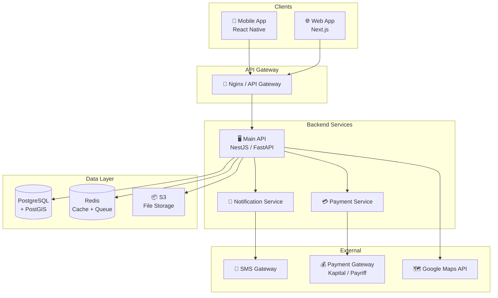
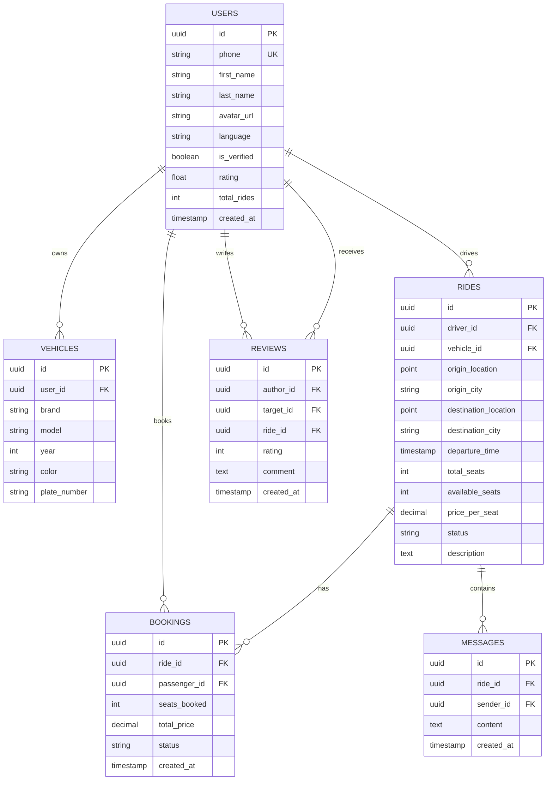

# 🚗 YolUstu — План проекта

> Платформа попутных поездок для Азербайджана (аналог BlaBlaCar)

---

## 1. Обзор продукта

| Параметр | Описание |
|---|---|
| **Название** | YolUstu (Yol Üstü — «По пути») |
| **Суть** | Мобильное приложение + веб-платформа для поиска и предложения попутных поездок по Азербайджану |
| **Целевая аудитория** | Водители и пассажиры, путешествующие между городами Азербайджана (Баку ↔ Гянджа, Баку ↔ Ленкорань, Баку ↔ Шеки и т.д.) |
| **Проблема** | Нет удобного цифрового сервиса для поиска попутчиков. Люди ищут попутки через WhatsApp-группы, Telegram и «сарафанное радио» |
| **Решение** | Централизованная платформа с верификацией, рейтингами, онлайн-оплатой и удобным поиском |

---

## 2. Ключевые фичи (MVP)

### 2.1 Для пассажиров
- 🔍 Поиск поездок по маршруту, дате и времени
- 📍 Указание промежуточных точек посадки/высадки
- 💳 Онлайн-бронирование и оплата
- ⭐ Рейтинг и отзывы о водителях
- 💬 Чат с водителем после бронирования
- 🔔 Push-уведомления о статусе поездки

### 2.2 Для водителей
- ➕ Публикация поездки (маршрут, дата, время, цена, кол-во мест)
- 🔄 Повторяющиеся поездки (регулярные маршруты)
- ✅ Подтверждение / отклонение пассажиров
- 💰 Получение оплаты на карту / баланс
- ⭐ Рейтинг и отзывы о пассажирах

### 2.3 Общие
- 📱 Регистрация через номер телефона (OTP через SMS)
- 🪪 Верификация личности (фото удостоверения + селфи)
- 🗺️ Интерактивная карта маршрута
- 🌐 Мультиязычность: Azerbaijani (основной), Русский, English

---

## 3. Фичи после MVP (v2+)

- 🚕 Регулярные маршруты с автоматическим созданием поездок
- 👥 Групповые поездки (несколько пассажиров — один водитель)
- 🏆 Система лояльности и промокоды
- 📊 Аналитика для водителей (заработок, статистика)
- 🔗 Интеграция с картой ASAN (государственная верификация)
- 🚌 Партнёрство с автобусными компаниями
- 📦 Доставка посылок попутно
- 🆘 Кнопка SOS и отслеживание поездки в реальном времени

---

## 4. Технический стек

### 4.1 Мобильные приложения
| Компонент | Технология | Обоснование |
|---|---|---|
| Фреймворк | **React Native** или **Flutter** | Один код на iOS + Android, быстрый выход на рынок |
| Навигация | React Navigation / GoRouter | — |
| Состояние | Zustand / Riverpod | Простота и производительность |
| Карты | **Google Maps SDK** | Хорошее покрытие Азербайджана |

### 4.2 Backend
| Компонент | Технология | Обоснование |
|---|---|---|
| API | **Node.js + NestJS** или **Python + FastAPI** | Быстрая разработка, хорошая экосистема |
| База данных | **PostgreSQL** | Надёжность, PostGIS для геозапросов |
| Кэш | **Redis** | Сессии, кэширование маршрутов |
| Очереди | **BullMQ** (Redis) | Уведомления, email, SMS |
| Хранилище | **AWS S3** / **MinIO** | Фото профилей, документы |
| Поиск | **PostGIS** + PostgreSQL | Геопространственный поиск поездок |

### 4.3 Веб-приложение
| Компонент | Технология |
|---|---|
| Фреймворк | **Next.js** (React) |
| UI | Tailwind CSS + Shadcn/UI |
| Карты | Google Maps JS API |

### 4.4 Инфраструктура
| Компонент | Технология |
|---|---|
| Хостинг | **AWS** / **DigitalOcean** |
| CI/CD | GitHub Actions |
| Контейнеризация | Docker + Docker Compose |
| Мониторинг | Sentry + Grafana |
| SMS-провайдер | **Azerbaijani SMS gateway** (например, lsim.az или oxu SMS) |
| Оплата | **Kapital Bank e-commerce** или **Payriff** (MilliÖn) |

---

## 5. Архитектура (высокоуровневая)

---

## 6. Схема базы данных (ключевые таблицы)

---

## 7. Фазы разработки

### Фаза 1 — Фундамент (6-8 недель)
| # | Задача | Верификация |
|---|---|---|
| 1 | Настройка проекта (monorepo, CI/CD, Docker) | `docker compose up` запускает всё |
| 2 | Модель данных + миграции PostgreSQL | Миграции проходят, таблицы созданы |
| 3 | Аутентификация (SMS OTP, JWT) | Можно зарегистрироваться и войти по SMS |
| 4 | CRUD API для поездок | Можно создать, найти, редактировать, удалить поездку |
| 5 | Геопоиск поездок (PostGIS) | Поиск по маршруту возвращает релевантные поездки |

### Фаза 2 — Основной функционал (6-8 недель)
| # | Задача | Верификация |
|---|---|---|
| 1 | Система бронирования | Пассажир бронирует место → статус обновляется |
| 2 | Чат между водителем и пассажиром | Сообщения доставляются в реальном времени (WebSocket) |
| 3 | Push-уведомления (FCM / APNs) | Уведомления приходят при бронировании, отмене, сообщении |
| 4 | Рейтинги и отзывы | После поездки можно оставить отзыв |
| 5 | Профиль пользователя + верификация | Загрузка документов, модерация |

### Фаза 3 — Оплата и мобильное приложение (6-8 недель)
| # | Задача | Верификация |
|---|---|---|
| 1 | Интеграция с Payriff / Kapital Bank | Тестовый платёж проходит |
| 2 | Мобильное приложение (основные экраны) | Поиск, бронирование, профиль работают |
| 3 | Карта маршрута (Google Maps) | Маршрут отображается на карте |
| 4 | Веб-лендинг + SEO | Сайт доступен, индексируется |

### Фаза 4 — Запуск и рост (4-6 недель)
| # | Задача | Верификация |
|---|---|---|
| 1 | Бета-тестирование (50-100 пользователей) | Критические баги найдены и исправлены |
| 2 | Админ-панель (модерация, аналитика) | Админ видит статистику, может блокировать |
| 3 | Оптимизация производительности | Время ответа API < 200ms (p95) |
| 4 | Публикация в App Store + Google Play | Приложение прошло ревью |

---

## 8. Бизнес-модель

| Источник дохода | Описание |
|---|---|
| **Сервисный сбор** | 10-15% от стоимости бронирования с пассажира |
| **Promoted rides** | Водители могут продвигать свои поездки в поиске |
| **Верификация PRO** | Расширенная верификация для повышения доверия |
| **Партнёрства** | Страхование поездок, автосервисы, заправки |

---

## 9. Локализация для Азербайджана

> [!IMPORTANT]
> Эти аспекты критичны для успеха именно на азербайджанском рынке.

- **Язык**: Основной UI на азербайджанском, поддержка русского и английского
- **Валюта**: Все цены в AZN (₼)
- **Оплата**: Интеграция с местными банками (Kapital Bank, ABB, Payriff/MilliÖn)
- **SMS**: Местный SMS-провайдер для доставки OTP
- **Популярные маршруты**: Предустановленные маршруты (Bakı–Gəncə, Bakı–Lənkəran, Bakı–Şəki, Bakı–Quba, Bakı–Şamaxı)
- **Юридические аспекты**: Консультация с юристом по законодательству о перевозках в АР
- **Культурные особенности**: Возможность указать предпочтения (курение, музыка, женский-only поездки)

---

## 10. Ключевые метрики (KPI)

| Метрика | Цель (первые 6 месяцев) |
|---|---|
| Регистрации | 5,000+ пользователей |
| Активные поездки в месяц | 500+ |
| Конверсия поиск → бронирование | > 15% |
| Средний рейтинг водителей | > 4.5 |
| Время ответа API (p95) | < 200ms |
| Crash-free rate (мобильное приложение) | > 99.5% |

---

## 11. Конкурентные преимущества

1. **Первопроходец** — нет прямого конкурента в Азербайджане
2. **Локализация** — полная адаптация под местный рынок (язык, оплата, маршруты)
3. **Доверие** — верификация через удостоверение, рейтинги, отзывы
4. **Удобство** — простой UX vs. хаотичные WhatsApp-группы
5. **Безопасность** — кнопка SOS, отслеживание маршрута, страхование

---

## 12. Риски и митигация

| Риск | Митигация |
|---|---|
| Низкая начальная база пользователей (проблема курицы и яйца) | Начать с 2-3 популярных маршрутов, привлечь водителей бонусами |
| Пользователи договариваются напрямую, обходя платформу | Предложить страховку и удобство только через платформу |
| Конкуренция со стороны BlaBlaCar | Глубокая локализация, которую международный игрок не обеспечит |
| Юридические ограничения | Юрист + диалог с регулятором на раннем этапе |
| Безопасность пассажиров | Верификация, SOS, отслеживание, страхование |

---

> [!TIP]
> **Рекомендация по старту**: Начни с веб-версии (Next.js) + бота в Telegram как MVP. Это позволит валидировать идею с минимальными затратами до разработки полноценного мобильного приложения.
